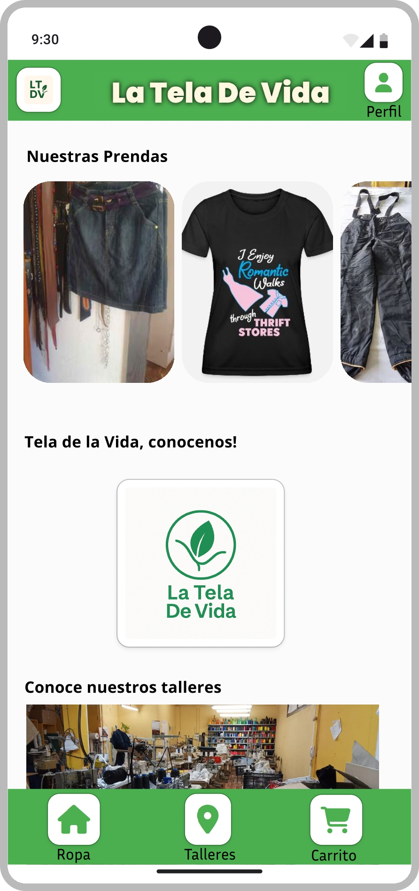
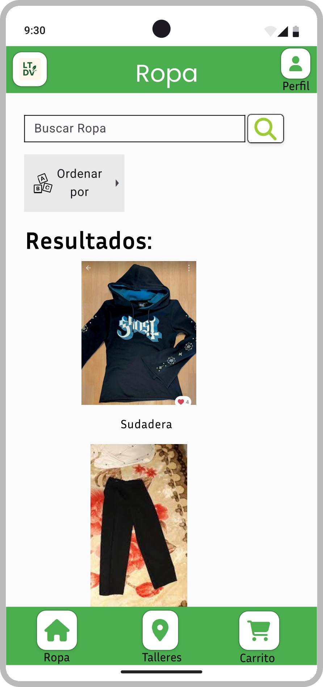
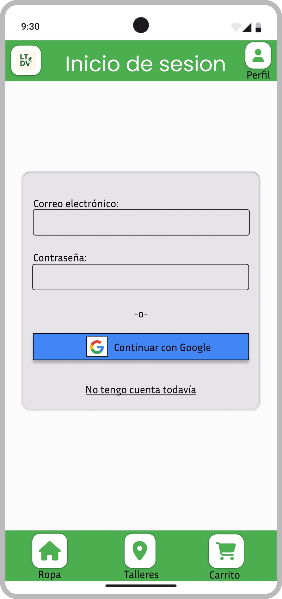
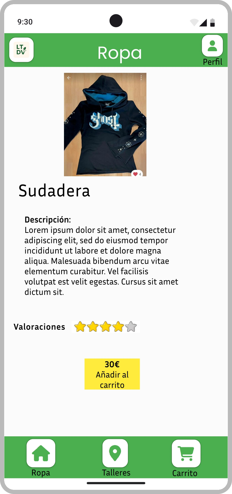
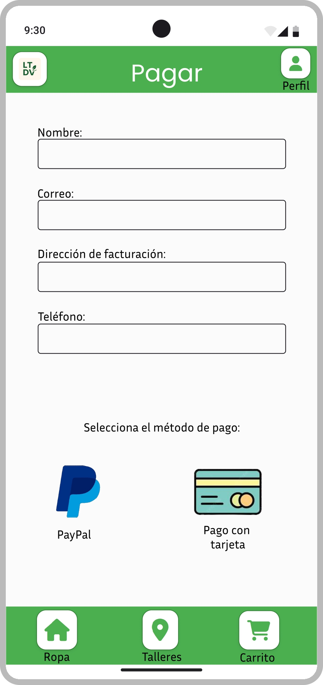

## Paso 3. Mi UX-Case Study (diseño)

### 3.a Moodboard

[Moodboard](https://github.com/DIU3-LEVELING/UX_CaseStudy/blob/master/P3/Moodboard25.pdf)

El nombre de tela de la vida pretende transmitir nuestro objetivo como empresa, que no es otro que el de darle una nueva vida a la ropa.

Nuestro logo es sencillo e intenta expresar nuestro compromiso con el medio ambiente.
Nuestra gama de colores presentan tonos pastelosos.
Hemos elegido unas tipografías sencillas y elegantes como el logo, siendo estas "Poppins" e "Open Sans".
Hemos empleado un conjunto de iconos ampliamente estandárizados y adaptados a nuestra gama de color.

### 3.b Landing Page
 
 
[Landing Page](https://github.com/DIU3-LEVELING/UX_CaseStudy/blob/master/P3/LandingPage.pdf) 

### 3.c Guidelines
 

Los patrones que hemos decidido usar para la creación del prototipo son:

Onboarding: Creación de pantalla de bienvenida.

Menu: Lista de apartados de navegación disponibles.

Carousel: Sección destacada de imágenes.

Search: Barra de busqueda.

Article list: Una lista de artículos con tarjetas.

Compra: Una pantalla para comprar.

Formulario de entrada de datos: Formulario para capturar la información de usuarios.

Acerca de: Mostramos la información de la empresa.

Wizard: Hemos creado una secuencia de pasos.

Elegir Prenda:

Abrimos la pestaña de prendas.
Navegamos hasta encontrar la prenda que deseamos.
Clicamos en la prenda que queremos comprar.
Una vez dentro añadimos al carrito.

Pagar:

Abrimos el carrito: Seleccionamos el icono del carrito para ver todo lo que tenemos ya en él. Aquí se mostrará el importe total a pagar.
Elegimos método de pago: Elegimos entre tarjeta y paypal.
Introducimos datos de la tarjeta y pinchamos en "Usar esta tarjeta".
Se te mostrará un resumen de la compra y confirmaremos el pago clicando en la opción "Pagar".

### 3.d Mockup
 

https://www.figma.com/design/u0xPnFSoru3xrFww3blOrQ/guidelines?node-id=0-1&t=8hRuzovCI2otVrkV-1 En este enlace tenemos los diseños realizados. Seleccionando el botón Play que sale en la esquina superior izquierda de figma nos mandará a otra pestaña y a partir de ella podremos interactuar con la aplicación clicando en los distintos botones.

 

### 3.e My UX-Case Study
 

Todos los resultados de la practica, asi como la documentacion sobbre como se ha realizado, se puede encontrar en: [Readme](https://github.com/DIU3-LEVELING/UX_CaseStudy/blob/master/README.md)

 
