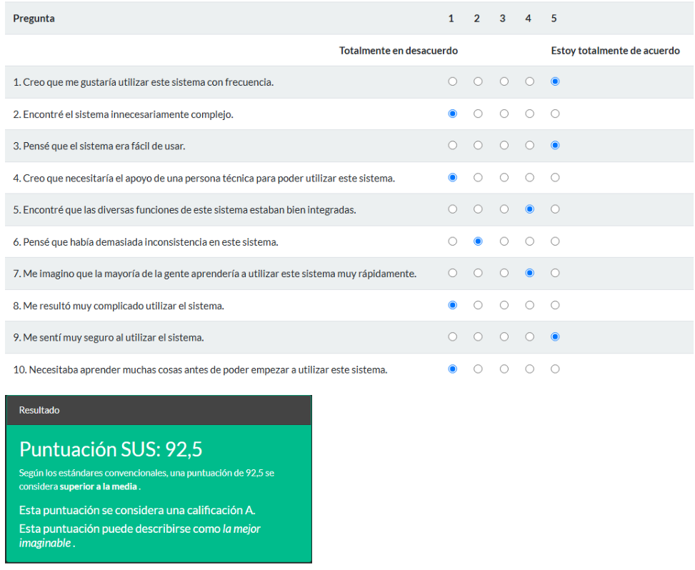
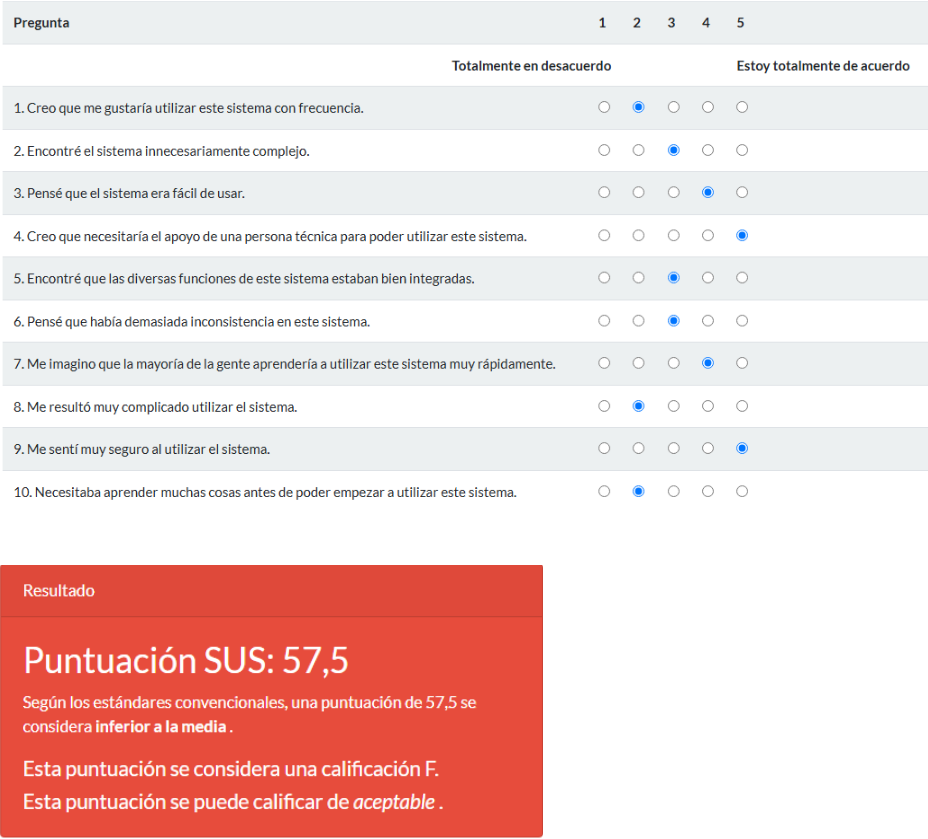
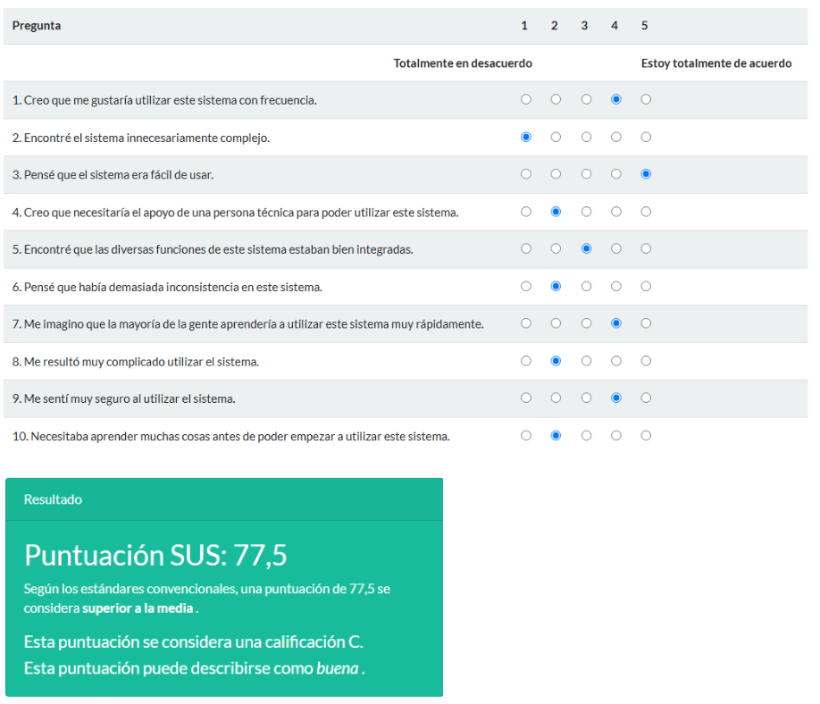
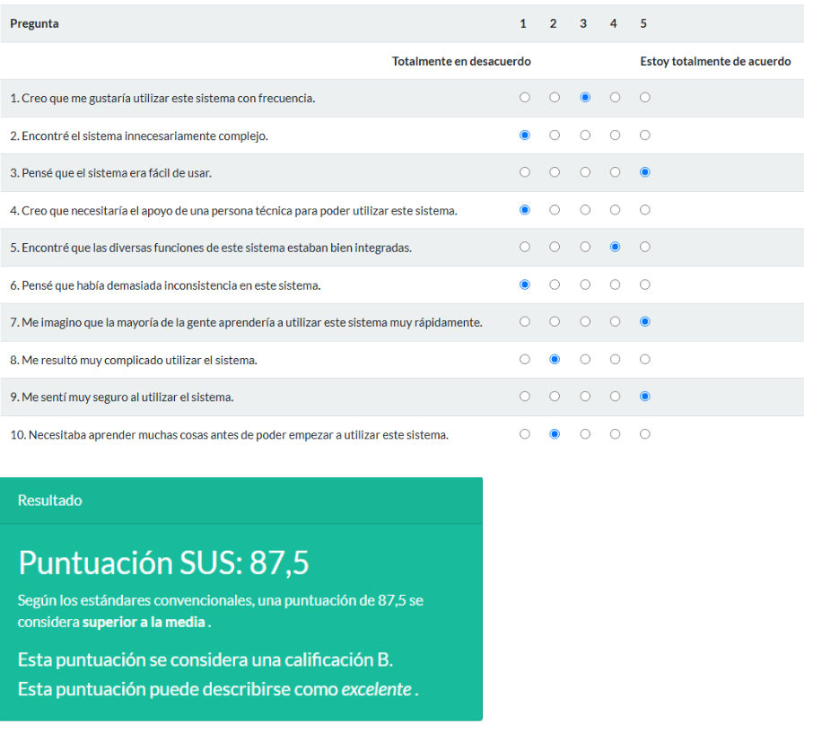
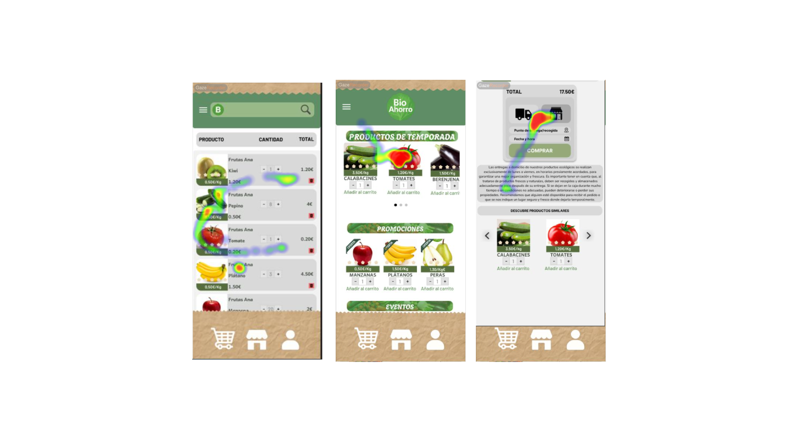
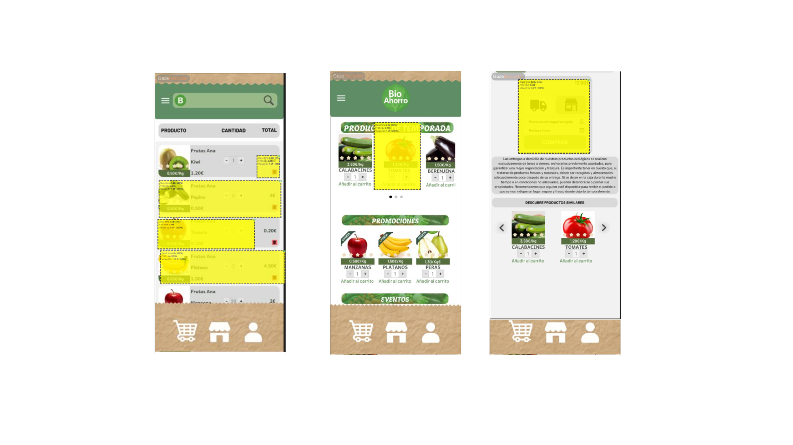
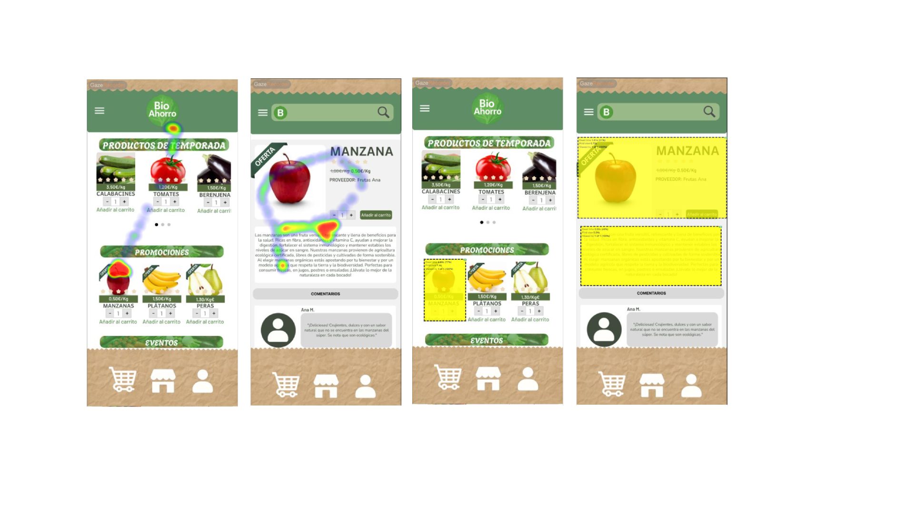

## Paso 4. Pruebas de Evaluación 

### 4.a Reclutamiento de usuarios 

| Usuarios | Sexo/Edad     | Ocupación   |  Exp.TIC    | Personalidad | Plataforma | Caso
| ------------- | -------- | ----------- | ----------- | -----------  | ---------- | ----
| Manuel  | H / 22   | Estudiante  | Alta       | Extrovertido | Windows       | A 
| Pedro  | H / 68   | Jubilado  |    Baja    |    Racional    | Móvil        | A 
| Rosa  | M / 34   | Profesora     | Media        | Emocional    | Windows      | B 
| Jorge | H / 19   | Estudiante  | Alta       |  Timido     | Móvil        | B 

### 4.b Diseño de las pruebas 
 

| Nº | Tipo de prueba     | Caso A – La Tela de Vida                                   | Caso B – BioAhorro                                                  | Métrica principal                     |
|----|---------------------|------------------------------------------------------------|----------------------------------------------------------------------|----------------------------------------|
| 1  | Tarea guiada        | Comprar un producto desde la página principal              | Comprar tomates desde el listado de productos                       | % de éxito, número de clics           |
| 2  | Tarea guiada        | Acceder a la sección “Conócenos” desde el menú             | Consultar información de las manzanas en su ficha de producto       | Tiempo (s), % de éxito                |
| 3  | Cuestionario SUS    | Evaluación posterior a tareas guiadas                      | Evaluación posterior a tareas guiadas                               | Puntuación SUS (0–100)                |
| 4  | Eye-tracking (Maze + GazeRecorder) | No se aplica                                       | Comprar tomates + consultar información de manzanas                | TTFF (Time to First Fixation), %AOI   |

### 4.c Cuestionario SUS
 
 
 
 
 

Como podemos apreciar en los resultados, la diferencia principal se puede ver en como esta de familiarizado la persona con la teconologia, puesto que los 2 estudiantes que estaban muy familiarizados con la tecnologia han recibido A y B, y la profesora con un punto intermedio una C. Pero si vemos al jubilado, obtuvo una F, puesto que le cuesta mucho mas la tecnologia al no estar familiarizado con ella

### 4.d A/B Testing
 
-----

## Evaluación de tareas clave – Casos A y B

Se presentan los resultados de las tareas clave para cada caso (A y B), evaluando el porcentaje de éxito, tiempo medio y número de clics. Cada app se analiza dentro de su propio contexto funcional.

### Caso A – La Tela De Vida

| Tarea                          | % Éxito | Tiempo medio | Clics medios |
|-------------------------------|---------|---------------|---------------|
| Comprar producto              | 100 %   | 42 s          | 6             |
| Llegar a la página “Conócenos”| 100 %   | 20 s          | 2             |
| **Media general**             | **100 %** | **31 s**     | **4**         |

### Caso B – BioAhorro

| Tarea                              | % Éxito | Tiempo medio | Clics medios |
|-----------------------------------|---------|---------------|---------------|
| Comprar tomates                   | 75 %    | 60 s          | 8             |
| Llegar a información de manzanas  | 50 %    | 45 s          | 7             |
| **Media general**                 | **63 %** | **52,5 s**    | **7,5**       |

Cada app se evalúa sobre sus procesos críticos. **La Tela De Vida** mantiene una excelente usabilidad, con un 100 % de éxito en ambas tareas y bajo esfuerzo en términos de tiempo y clics. Por el contrario, **BioAhorro** presenta dificultades notables en accesibilidad a la información y en el proceso de compra, con una tasa de éxito media inferior y mayor número de clics requeridos.

### 4.e Aplicación del método Eye Tracking 

----
Para evaluar el comportamiento visual de los usuarios en la app **BioAhorro** (Caso B), se diseñó un experimento de Eye Tracking utilizando la herramienta [GazeRecorder](https://www.gazerecorder.com/). Se empleó la versión gratuita, que permite hasta 3 participantes con generación de mapas de calor.

### Tareas evaluadas

1. **Comprar un producto (tomates):**  
   Se pidió al usuario que localizara y añadiera tomates al carrito y los comprara. Esta tarea permitió observar la atención visual en el listado de productos y en los botones de compra.

2. **Consultar información de un producto (manzanas):**  
   El usuario debía acceder a la ficha de un producto (manzanas) y leer su descripción. Esta tarea sirvió para detectar cómo se distribuye la atención entre imagen, precio y detalles del producto.

### Resultados visuales

A continuación, se muestran dos mapas de calor representativos generados durante las tareas anteriores:

*Figura 1. Mapa de calor mientras se seleccionaban tomates para la compra.*

*Figura 2. Mapa de calor durante la consulta de información sobre manzanas.*

### 4.f Usability Report de B
 
-----
# Informe de Usabilidad – BioAhorro

## Evaluación de usabilidad del proyecto

**Equipo evaluado:** DIU1_FernandoAdam  
**Fecha:** 26/05/2025  
**Repositorio original:** [https://github.com/Adman23/UX_CaseStudy](https://github.com/Adman23/UX_CaseStudy)  
**Evaluado por:** DIU3_Leveling

Somos un grupo con experiencia previa en diseño de interfaces, validación con usuarios y pruebas con herramientas de prototipado como Figma y Maze. En esta práctica, nos hemos encargado de evaluar la práctica del equipo DIU1_FernandoAdam a través de técnicas como A/B testing, cuestionario SUS y Eye Tracking simulado.

## 1. Descripción del Website
 

BioAhorro es una plataforma que facilita el acceso a productos ecológicos de forma sencilla, sostenible y económica. Está orientada a conectar a los usuarios con pequeños productores locales, ofrecer recetas, productos destacados y fomentar el consumo responsable desde una interfaz accesible, moderna y clara.

## 2. Resumen Ejecutivo

Este informe presenta los resultados del test de usabilidad realizado sobre el prototipo de BioAhorro. A través de la combinación de métodos (A/B testing, cuestionario SUS y Eye Tracking simulado), hemos detectado puntos fuertes en accesibilidad, estética y jerarquía visual, así como áreas de mejora relacionadas con el menú desplegable, la visibilidad de botones de compra y la navegación entre secciones.

## 3. Metodología

### Técnicas utilizadas

- A/B Testing con tareas específicas: búsqueda de información de un producto, compra de producto.
- Simulación de Eye Tracking mediante tareas de atención visual y AOIs.
- Cuestionario SUS al finalizar las tareas.
- Proyecto evaluado en Maze, con prototipo interactivo en Figma.

### Test de usuarios: Participantes

| Usuario | Sexo / Edad | Ocupación  | Exp. TIC | Personalidad | Plataforma | Caso |
|--------|-------------|------------|----------|--------------|------------|------|
| Rosa   | M / 34      | Profesora  | Media    | Emocional    | Windows    | B    |
| Jorge  | H / 19      | Estudiante | Alta     | Tímido       | Móvil      | B    |

## 4. Conclusiones
 
 
El prototipo demuestra un buen nivel de usabilidad y accesibilidad. El diseño es claro y visualmente atractivo. La experiencia de compra resulta intuitiva en general. Sin embargo, algunos elementos menos visibles requieren ajustes para mejorar la eficacia de la navegación, especialmente en dispositivos móviles.

### Incidencias

- Diseño coherente con la identidad ecológica.
- Navegación clara y sin errores técnicos.
- Buen uso de tarjetas informativas para productos y recetas.
- Jerarquía visual correcta en página de inicio.

### Recomendaciones y propuesta de mejoras

- Reforzar la visibilidad de botones clave como “Comprar” o “Añadir al carrito”.
- Mejorar la velocidad de despliegue y visibilidad del menú hamburguesa en móvil.
- Destacar más claramente las secciones de contacto y ayuda.
- Ampliar contraste en enlaces secundarios.

### Valoración de la prueba de usabilidad

Consideramos que las técnicas empleadas han sido muy útiles para identificar puntos de mejora no evidentes durante el diseño. La combinación de observación y análisis cuantitativo (SUS) nos permitió obtener una imagen clara y objetiva del funcionamiento del prototipo. Repetiríamos este enfoque en futuros proyectos.

Las técnicas empleadas han resultado especialmente útiles para detectar problemas de usabilidad que no eran evidentes durante el diseño inicial. A través del A/B testing pudimos observar cómo los usuarios reales interactúan con la interfaz, identificando momentos de duda o confusión en ciertas tareas que, desde el punto de vista del diseñador, parecían resueltas.

El cuestionario SUS permitió obtener una valoración cuantitativa clara sobre la experiencia general, y fue clave para confirmar que el diseño era sólido, aunque todavía mejorable en ciertos aspectos como accesibilidad y jerarquía visual.

Aunque no se pudo aplicar un sistema de eye tracking real, la simulación mediante tareas dirigidas ayudó a detectar AOIs que pasaban desapercibidas para los usuarios, revelando fallos sutiles en la disposición y visibilidad de elementos importantes como botones secundarios o enlaces de contacto.

En resumen, estas técnicas nos han ofrecido una visión más objetiva del comportamiento del usuario, han validado muchas decisiones de diseño y, al mismo tiempo, nos han permitido mejorar el producto final con cambios concretos. Consideramos que han sido fundamentales para afinar el diseño y nos gustaría aplicar este proceso también en futuros proyectos.

## 5. Resultados de Eye Tracking

La simulación mediante tareas dirigidas permitió observar:

- Zonas que captan atención inmediata (imagen de producto, precio).
- Elementos poco visibles como enlaces secundarios y botones de acción.
- Diferencias entre comportamiento en escritorio y móvil.

### Imágenes :

  
  

 
