# DIU25
Prácticas Diseño Interfaces de Usuario (Tema: Reciclaje y artesanía (handcraft) ) 

[Guiones de prácticas](GuionesPracticas/)

Grupo: DIU3_Leveling.  Curso: 2024/25 

Proyecto: 

Tela de Vida

Descripción: 

Promover la moda circular, ofreciendo una plataforma confiable donde las personas puedan comprar ropa usada de calidad y tener la opcion de darle un toque personal en nuestros talleres.

Logotipo: 

Miembros:
 * :bust_in_silhouette:  Francisco Domene Lujan     :octocat:     
 * :bust_in_silhouette:  Marco Armijo Gonzalez     :octocat:

# Proceso de Diseño 

 

## Paso 1. UX User & Desk Research & Analisis 

### 1.a User Reseach Plan
Nosotros somos estudiantes con experiencia en desarrollo web gracias a que hemos cursado la asignatura de "Programación Web" y ahora mismo estamos haciendo la asignatura de "Sistemas de Información Basados en Web". Nuestro conocimiento sobre moda es básico, y sobre páginas web sobre moda, hemos visto y visitado páginas como Zara, Nike, adidas... También hemos comprado y usado Zalando o Shein para comprar ropa.

Nuestra estrategia de investigación será:

Identificar a los usuarios: definiremos perfiles de las personas involucradas (creadores, consumidores, participantes de talleres) y sus motivaciones.

Explorar las experiencias: analizaremos cómo los usuarios con interés en estas iniciativas interactúan con las mismas, desde el descubrimiento hasta la compra o participación en talleres.

Evaluar la percepción de valor: investigaremos qué aspectos del concepto de moda de reciclaje y artesanía local valoran los usuarios (sostenibilidad, exclusividad, calidad, etc.).

Descubrir barreras y oportunidades: identificaremos los retos que los usuarios encuentran y posibles mejoras en la experiencia.

 
[User Research](https://github.com/DIU3-LEVELING/UX_CaseStudy/blob/master/P1/USER%20RESEARCH%20PLAN.pdf)

### 1.b Competitive Analysis
 
 
Hemos elegido Casakuna por ser un negocio local con enfoque en moda sostenible y porque su web muestra margen de mejora frente a otras como Modare y OhOhJuly. A diferencia de estas, Casakuna presenta una estructura básica, baja visibilidad digital y contenido limitado. Modare destaca por su plataforma completa y misión clara; OhOhJuly, por su diseño atractivo y usabilidad enfocada al cliente. Casakuna podría mejorar su comunicación, diseño y servicios online. Esto le permitiría ampliar su alcance e impacto en la comunidad.

[Competitive Analysis](https://github.com/DIU3-LEVELING/UX_CaseStudy/blob/master/P1/Competitor%20Analysis%20%5BDIU23%5D.png)

### 1.c Personas
 
Julia González es una mujer de 30 años, española, que trabaja como vendedora en una tienda de ropa vintage en Granada. Es una persona apasionada por la sostenibilidad, la moda circular y el consumo responsable. Le encanta restaurar ropa de segunda mano, practicar yoga, hacer senderismo y participar en talleres de reciclaje y autosuficiencia. Valora la autenticidad, la conexión con la naturaleza y la creatividad. Sus principales preocupaciones son el alto costo de productos ecológicos, el consumo excesivo y la falta de apoyo a iniciativas sostenibles. Es colaborativa, abierta de mente y tiene conocimientos sobre sostenibilidad y restauración textil.

[#1](https://github.com/DIU3-LEVELING/UX_CaseStudy/blob/master/P1/Persona%20%231.png)

Manuel López es un hombre de 45 años, español, que trabaja como profesor de Historia en un instituto de Granada. Es un padre amable y tradicional, pero abierto a aprender cosas nuevas por su hija Sofía, una adolescente interesada en la sostenibilidad. Manuel quiere ser un buen ejemplo para ella, apoyar la economía local y aprender sobre consumo responsable. Tiene poco tiempo por su trabajo y ciertas dudas sobre la ropa de segunda mano, especialmente en cuanto a calidad y rentabilidad. Es organizado, adaptable y algo introvertido, pero está dispuesto a colaborar y salir de su zona de confort cuando se trata de su familia.

 [#2](https://github.com/DIU3-LEVELING/UX_CaseStudy/blob/master/P1/Persona%20%232.png)

### 1.d User Journey Map

 
Julia y Manuel representan dos perfiles de usuario con necesidades distintas dentro del ámbito de la moda sostenible y de segunda mano. Julia, estudiante preocupada por el impacto ambiental, accede a la tienda por redes sociales y espera transparencia sobre materiales y procesos. Sin embargo, su experiencia se ve afectada por la falta de información clara en la web y una navegación poco amigable. Aun así, valora la atención personalizada y termina compartiendo su experiencia en redes. Por otro lado, Manuel, profesor que busca ropa para su hija, opta por visitar la tienda física tras ver que no hay opción online. Su proceso está marcado por la incertidumbre, pero mejora gracias a la atención en tienda, aunque persisten dudas sobre la calidad de las prendas.
 

 [#1](https://github.com/DIU3-LEVELING/UX_CaseStudy/blob/master/P1/User%20Journey%20Map%20%231.jpg)
 [#2](https://github.com/DIU3-LEVELING/UX_CaseStudy/blob/master/P1/User%20Journey%20Map%20%232.jpg)

### 1.e Usability Review
 
Casakuna.org ha obtenido una puntuación de 42 sobre 100 en nuestra evaluación de usabilidad.

La web de Re-Made in Granada (casakuna.org) muestra buenas intenciones en cuanto a propósito social y sostenibilidad, pero su experiencia de usuario es bastante deficiente. Aunque la página de inicio está bien estructurada y presenta la información general de forma clara, gran parte del sitio carece de funcionalidad efectiva: muchas secciones no funcionan, redirigen a páginas vacías o no permiten realizar acciones clave como visualizar productos o realizar compras. Esto genera frustración y limita la utilidad del sitio.

Además, la navegación es confusa: la página específica de Re-Made no está fácilmente accesible desde buscadores y el sistema de menús carece de atractivo visual. También presenta problemas graves como la ausencia de buscador, falta de retroalimentación en las acciones y errores no gestionados. En cuanto a contenido, aunque el lenguaje es apropiado y coherente, el sitio es pobre en información relevante y carece de recursos visuales atractivos que mejoren la experiencia.

En resumen, el sitio necesita una mejora urgente en funcionalidades clave, navegación, contenidos interactivos y accesibilidad para poder cumplir los objetivos del usuario y potenciar su impacto como plataforma de moda sostenible.
[Usability Review](https://github.com/DIU3-LEVELING/UX_CaseStudy/blob/master/P1/Usability-review.xlsx.pdf)
[Resumen Valoracion](https://github.com/DIU3-LEVELING/UX_CaseStudy/blob/master/P1/Resumen%20de%20la%20valoraci%C3%B3n%20pr%C3%A1ctica.pdf)

 

## Paso 2. UX Design  

### 2.a Empathy map 
  
Hemos realizado el Empathy Map para entender mejor a los usuarios interesados en la compra de ropa de segunda mano, quedando de la siguiente manera: los usuarios valoran la sostenibilidad, el ahorro y la exclusividad de las prendas, pero expresan preocupaciones sobre la higiene, el estado de la ropa y la dificultad para encontrar tallas. Además, las redes sociales juegan un papel clave como fuente de inspiración e impulso para compartir sus hallazgos y formar parte de una comunidad de moda sostenible.
_page-0001.jpg)
[Empathy map](https://github.com/DIU3-LEVELING/UX_CaseStudy/blob/master/P2/Empathy%20Customer%20Map%20Ropa%202%20Mano.pdf)

### 2.b ScopeCanvas

_page-0001.jpg)
[ScopeCanvas](https://github.com/DIU3-LEVELING/UX_CaseStudy/blob/master/P2/Scope%20Canvas%20(1).pdf)

### 2.c User Flow (task) analysis 
Primero hemos analizado las tareas y les hemos dado una prioridad (H, M o L) para los usuarios y los adminstradores.
  
En nuestro user flow, hemos representado el recorrido que sigue un usuario para registrarse, iniciar sesión y dejar una reseña sobre una prenda en la web. El flujo comienza en el portal, donde el usuario puede crear una cuenta introduciendo sus datos correctamente o recibiendo mensajes de error si hay fallos. Una vez creada la cuenta e iniciada sesión, el usuario accede a la sección de ropa de segunda mano, selecciona una prenda y, si ha iniciado sesión, puede dejar su reseña. En caso contrario, se le solicita iniciar sesión antes de continuar. Este flujo refleja una de las tareas clave para fomentar la participación activa en la plataforma.
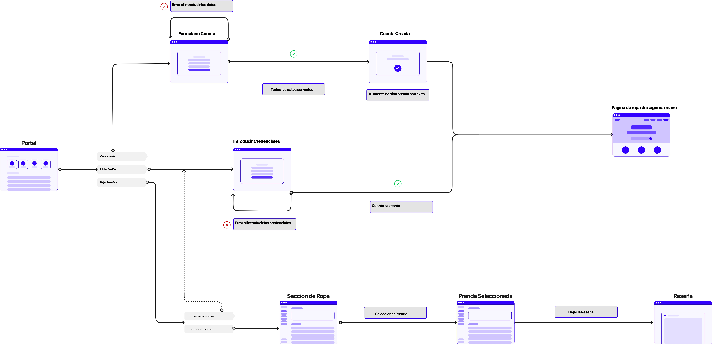
[User Flow](https://github.com/DIU3-LEVELING/UX_CaseStudy/blob/master/P2/User_Flow.pdf)

### 2.d IA: Sitemap + Labelling 
 
Nuestro Sitemap quedaría tal que así: 
  
[Sitemap](https://github.com/DIU3-LEVELING/UX_CaseStudy/blob/master/P2/sitemap.png) 
Y su Labelling: 
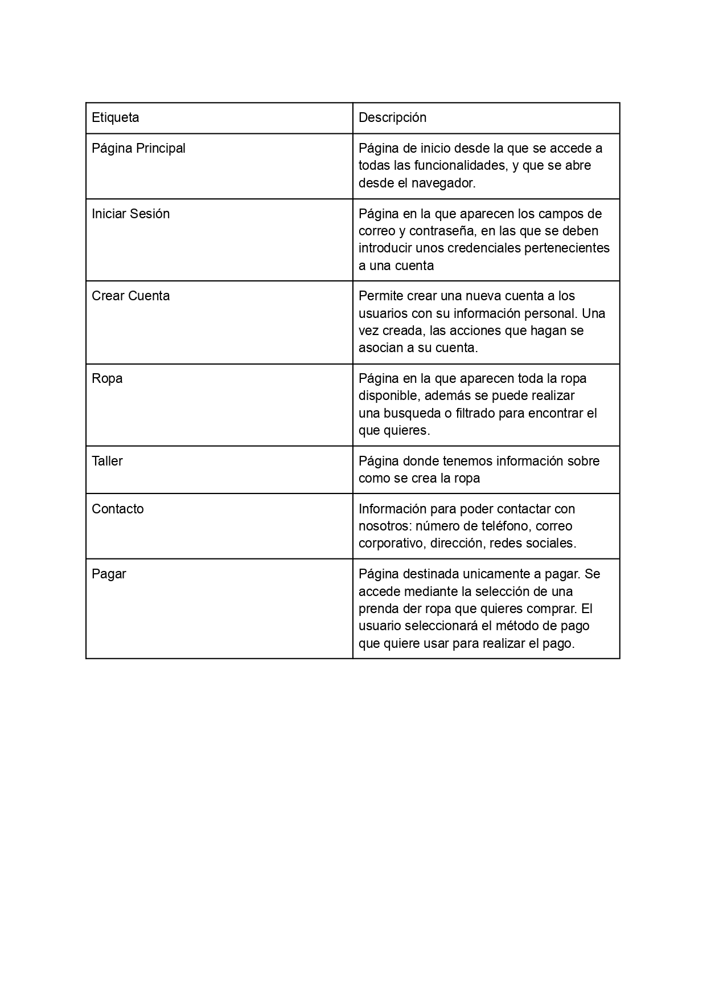  
[Labelling](https://github.com/DIU3-LEVELING/UX_CaseStudy/blob/master/P2/Etiquetado_.pdf)

### 2.e Wireframes
 
Para los Wireframes se ha utilizado figma, y han quedado de la siguiente manera: 

_page-0001.jpg) 
[Bocetos Figma](https://github.com/DIU3-LEVELING/UX_CaseStudy/blob/master/P2/Dise%C3%B1os_figma.pdf) 
Y los responsive: 

[Bocetos responsive](https://github.com/DIU3-LEVELING/UX_CaseStudy/blob/master/P2/responsive.pdf)

 

## Paso 3. Mi UX-Case Study (diseño)

### 3.a Moodboard

[Moodboard](https://github.com/DIU3-LEVELING/UX_CaseStudy/blob/master/P3/Moodboard25.pdf)

El nombre de tela de la vida pretende transmitir nuestro objetivo como empresa, que no es otro que el de darle una nueva vida a la ropa.

Nuestro logo es sencillo e intenta expresar nuestro compromiso con el medio ambiente.
Nuestra gama de colores presentan tonos pastelosos.
Hemos elegido unas tipografías sencillas y elegantes como el logo, siendo estas "Poppins" e "Open Sans".
Hemos empleado un conjunto de iconos ampliamente estandárizados y adaptados a nuestra gama de color.

### 3.b Landing Page
 
 
[Landing Page](https://github.com/DIU3-LEVELING/UX_CaseStudy/blob/master/P3/LandingPage.pdf) 

### 3.c Guidelines
 

Los patrones que hemos decidido usar para la creación del prototipo son:

Onboarding: Creación de pantalla de bienvenida.

Menu: Lista de apartados de navegación disponibles.

Carousel: Sección destacada de imágenes.

Search: Barra de busqueda.

Article list: Una lista de artículos con tarjetas.

Compra: Una pantalla para comprar.

Formulario de entrada de datos: Formulario para capturar la información de usuarios.

Acerca de: Mostramos la información de la empresa.

Wizard: Hemos creado una secuencia de pasos.

Elegir Prenda:

Abrimos la pestaña de prendas.
Navegamos hasta encontrar la prenda que deseamos.
Clicamos en la prenda que queremos comprar.
Una vez dentro añadimos al carrito.

Pagar:

Abrimos el carrito: Seleccionamos el icono del carrito para ver todo lo que tenemos ya en él. Aquí se mostrará el importe total a pagar.
Elegimos método de pago: Elegimos entre tarjeta y paypal.
Introducimos datos de la tarjeta y pinchamos en "Usar esta tarjeta".
Se te mostrará un resumen de la compra y confirmaremos el pago clicando en la opción "Pagar".
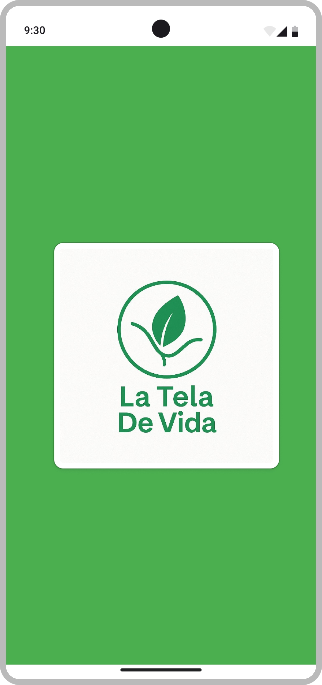
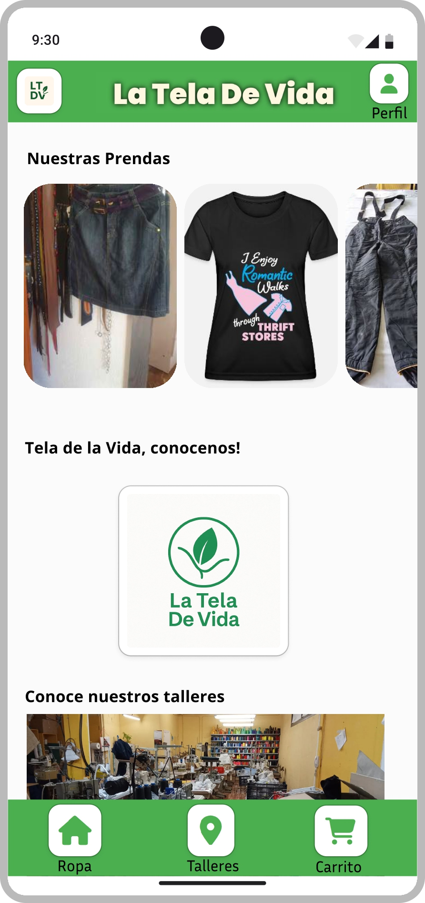
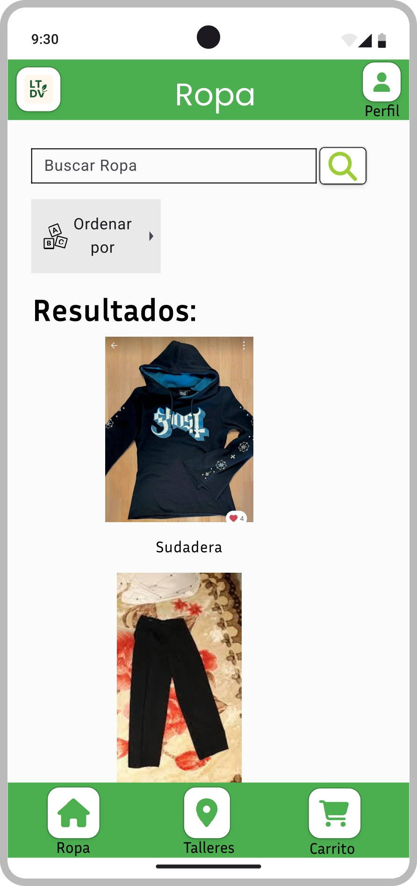
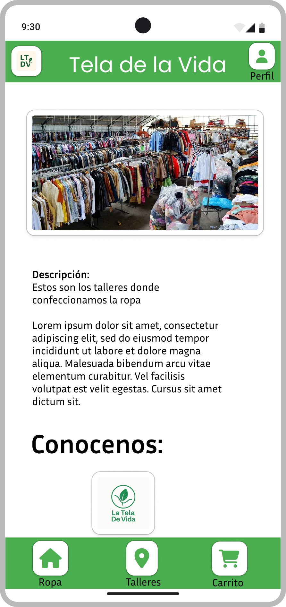
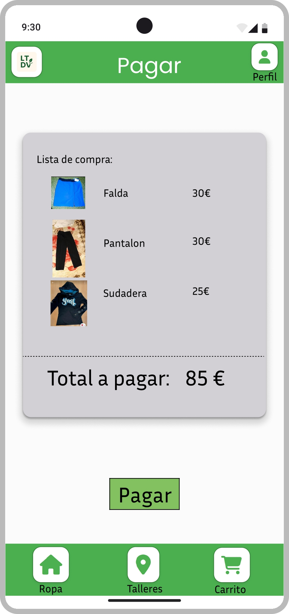
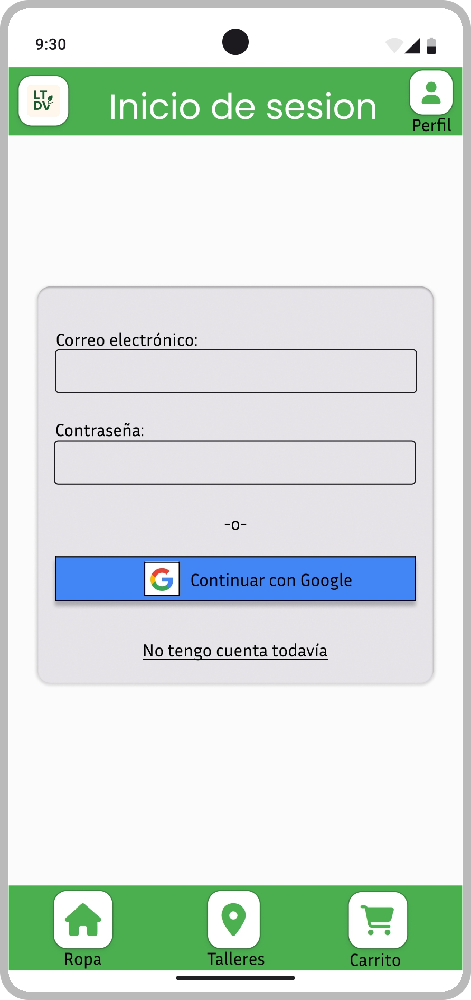
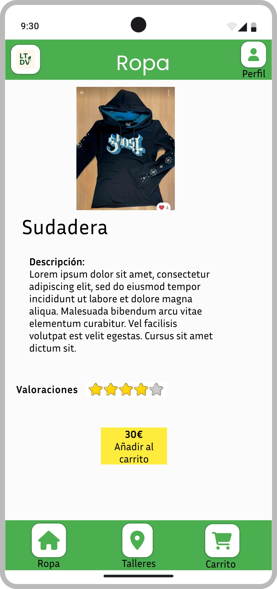
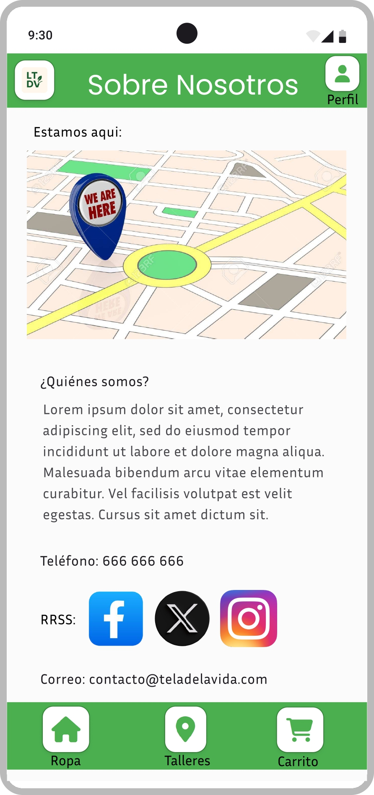
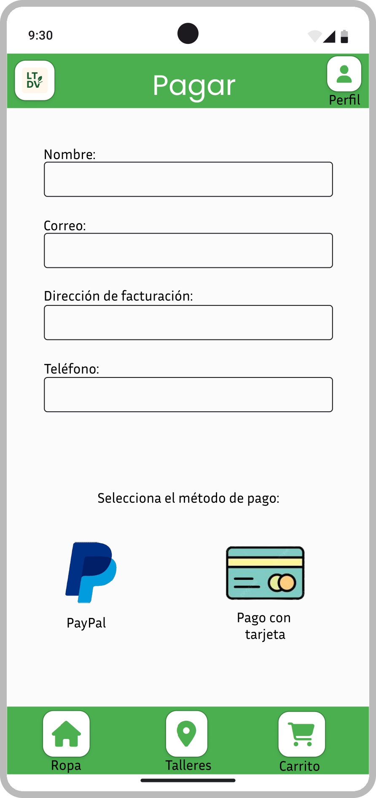
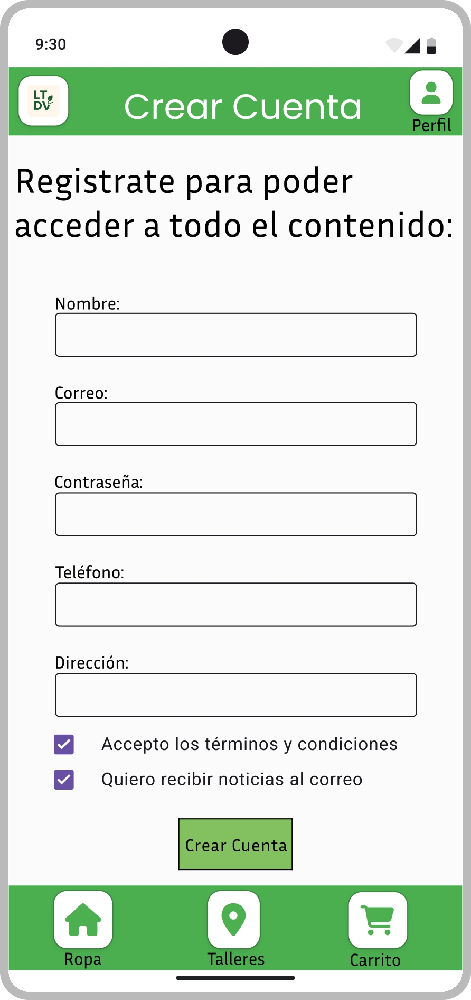
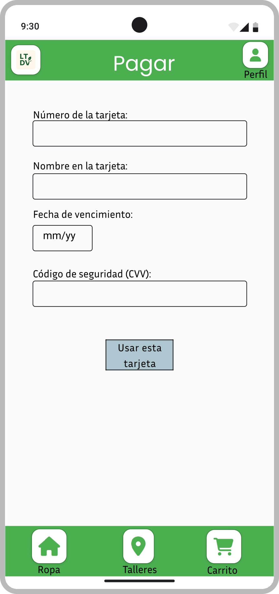
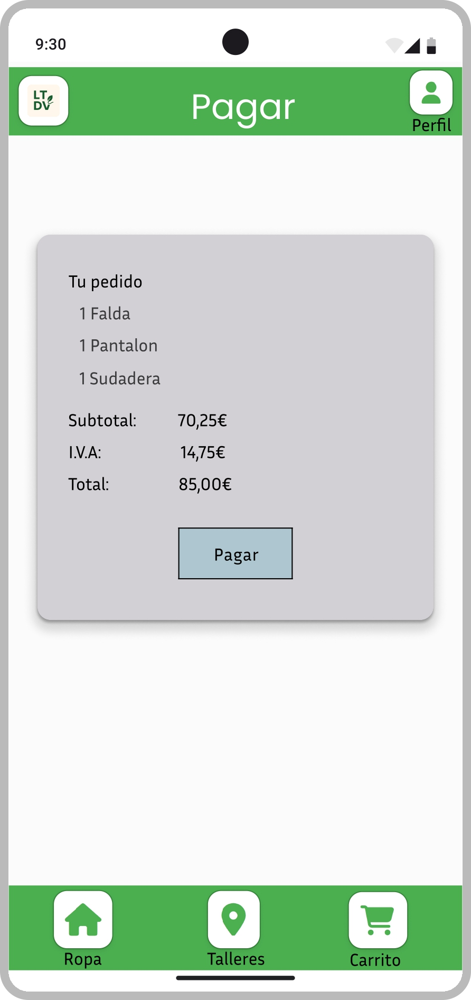

### 3.d Mockup
 

https://www.figma.com/design/u0xPnFSoru3xrFww3blOrQ/guidelines?node-id=0-1&t=8hRuzovCI2otVrkV-1 En este enlace tenemos los diseños realizados. Seleccionando el botón Play que sale en la esquina superior izquierda de figma nos mandará a otra pestaña y a partir de ella podremos interactuar con la aplicación clicando en los distintos botones.

 

### 3.e My UX-Case Study
 

Todos los resultados de la practica, asi como la documentacion sobbre como se ha realizado, se puede encontrar en: [Readme](https://github.com/DIU3-LEVELING/UX_CaseStudy/blob/master/README.md)

 

## Paso 4. Pruebas de Evaluación 

### 4.a Reclutamiento de usuarios 

| Usuarios | Sexo/Edad     | Ocupación   |  Exp.TIC    | Personalidad | Plataforma | Caso
| ------------- | -------- | ----------- | ----------- | -----------  | ---------- | ----
| Manuel  | H / 22   | Estudiante  | Alta       | Extrovertido | Windows       | A 
| Pedro  | H / 68   | Jubilado  |    Baja    |    Racional    | Móvil        | A 
| Rosa  | M / 34   | Profesora     | Media        | Emocional    | Windows      | B 
| Jorge | H / 19   | Estudiante  | Alta       |  Timido     | Móvil        | B 

### 4.b Diseño de las pruebas 
 

| Nº | Tipo de prueba     | Caso A – La Tela de Vida                                   | Caso B – BioAhorro                                                  | Métrica principal                     |
|----|---------------------|------------------------------------------------------------|----------------------------------------------------------------------|----------------------------------------|
| 1  | Tarea guiada        | Comprar un producto desde la página principal              | Comprar tomates desde el listado de productos                       | % de éxito, número de clics           |
| 2  | Tarea guiada        | Acceder a la sección “Conócenos” desde el menú             | Consultar información de las manzanas en su ficha de producto       | Tiempo (s), % de éxito                |
| 3  | Cuestionario SUS    | Evaluación posterior a tareas guiadas                      | Evaluación posterior a tareas guiadas                               | Puntuación SUS (0–100)                |
| 4  | Eye-tracking (Maze + GazeRecorder) | No se aplica                                       | Comprar tomates + consultar información de manzanas                | TTFF (Time to First Fixation), %AOI   |

### 4.c Cuestionario SUS
 
 
 
 
 

Como podemos apreciar en los resultados, la diferencia principal se puede ver en como esta de familiarizado la persona con la teconologia, puesto que los 2 estudiantes que estaban muy familiarizados con la tecnologia han recibido A y B, y la profesora con un punto intermedio una C. Pero si vemos al jubilado, obtuvo una F, puesto que le cuesta mucho mas la tecnologia al no estar familiarizado con ella

### 4.d A/B Testing
 
-----

## Evaluación de tareas clave – Casos A y B

Se presentan los resultados de las tareas clave para cada caso (A y B), evaluando el porcentaje de éxito, tiempo medio y número de clics. Cada app se analiza dentro de su propio contexto funcional.

### Caso A – La Tela De Vida

| Tarea                          | % Éxito | Tiempo medio | Clics medios |
|-------------------------------|---------|---------------|---------------|
| Comprar producto              | 100 %   | 42 s          | 6             |
| Llegar a la página “Conócenos”| 100 %   | 20 s          | 2             |
| **Media general**             | **100 %** | **31 s**     | **4**         |

### Caso B – BioAhorro

| Tarea                              | % Éxito | Tiempo medio | Clics medios |
|-----------------------------------|---------|---------------|---------------|
| Comprar tomates                   | 75 %    | 60 s          | 8             |
| Llegar a información de manzanas  | 50 %    | 45 s          | 7             |
| **Media general**                 | **63 %** | **52,5 s**    | **7,5**       |

Cada app se evalúa sobre sus procesos críticos. **La Tela De Vida** mantiene una excelente usabilidad, con un 100 % de éxito en ambas tareas y bajo esfuerzo en términos de tiempo y clics. Por el contrario, **BioAhorro** presenta dificultades notables en accesibilidad a la información y en el proceso de compra, con una tasa de éxito media inferior y mayor número de clics requeridos.

### 4.e Aplicación del método Eye Tracking 

----
Para evaluar el comportamiento visual de los usuarios en la app **BioAhorro** (Caso B), se diseñó un experimento de Eye Tracking utilizando la herramienta [GazeRecorder](https://www.gazerecorder.com/). Se empleó la versión gratuita, que permite hasta 3 participantes con generación de mapas de calor.

### Tareas evaluadas A
1. **Comprar un producto:**  
   Se pidió al usuario que localizara y añadiera un producto al carrito y los comprara. Esta tarea permitió observar la atención visual en el listado de productos y en los botones de compra.

2. **Acceder a la sección "Conócenos":**  
   El usuario debía navegar por el sitio hasta encontrar y acceder a la sección “Conócenos” desde el menú principal. Esta prueba sirvió para analizar la facilidad de acceso a información institucional y cómo se reparte la atención en el menú.

### Resultados visuales

A continuación, se muestran dos mapas de calor representativos generados durante las tareas anteriores:

  

*Figura 1. Mapa de calor mientras compra.*

  

*Figura 2. Mapa de calor durante la navegación hacia la sección "Conócenos".*

### Tareas evaluadas B

1. **Comprar un producto (tomates):**  
   Se pidió al usuario que localizara y añadiera tomates al carrito y los comprara. Esta tarea permitió observar la atención visual en el listado de productos y en los botones de compra.

2. **Consultar información de un producto (manzanas):**  
   El usuario debía acceder a la ficha de un producto (manzanas) y leer su descripción. Esta tarea sirvió para detectar cómo se distribuye la atención entre imagen, precio y detalles del producto.

### Resultados visuales

A continuación, se muestran dos mapas de calor representativos generados durante las tareas anteriores:

*Figura 1. Mapa de calor mientras se seleccionaban tomates para la compra.*

*Figura 2. Mapa de calor durante la consulta de información sobre manzanas.*

### 4.f Usability Report de B
 
-----
# Informe de Usabilidad – BioAhorro

## Evaluación de usabilidad del proyecto

**Equipo evaluado:** DIU1_FernandoAdam  
**Fecha:** 26/05/2025  
**Repositorio original:** [https://github.com/Adman23/UX_CaseStudy](https://github.com/Adman23/UX_CaseStudy)  
**Evaluado por:** DIU3_Leveling

Somos un grupo con experiencia previa en diseño de interfaces, validación con usuarios y pruebas con herramientas de prototipado como Figma y Maze. En esta práctica, nos hemos encargado de evaluar la práctica del equipo DIU1_FernandoAdam a través de técnicas como A/B testing, cuestionario SUS y Eye Tracking simulado.

## 1. Descripción del Website
 

BioAhorro es una plataforma que facilita el acceso a productos ecológicos de forma sencilla, sostenible y económica. Está orientada a conectar a los usuarios con pequeños productores locales, ofrecer recetas, productos destacados y fomentar el consumo responsable desde una interfaz accesible, moderna y clara.

## 2. Resumen Ejecutivo

Este informe presenta los resultados del test de usabilidad realizado sobre el prototipo de BioAhorro. A través de la combinación de métodos (A/B testing, cuestionario SUS y Eye Tracking simulado), hemos detectado puntos fuertes en accesibilidad, estética y jerarquía visual, así como áreas de mejora relacionadas con el menú desplegable, la visibilidad de botones de compra y la navegación entre secciones.

## 3. Metodología

### Técnicas utilizadas

- A/B Testing con tareas específicas: búsqueda de información de un producto, compra de producto.
- Simulación de Eye Tracking mediante tareas de atención visual y AOIs.
- Cuestionario SUS al finalizar las tareas.
- Proyecto evaluado en Maze, con prototipo interactivo en Figma.

### Test de usuarios: Participantes

| Usuario | Sexo / Edad | Ocupación  | Exp. TIC | Personalidad | Plataforma | Caso |
|--------|-------------|------------|----------|--------------|------------|------|
| Rosa   | M / 34      | Profesora  | Media    | Emocional    | Windows    | B    |
| Jorge  | H / 19      | Estudiante | Alta     | Tímido       | Móvil      | B    |

## 4. Conclusiones
 
 
El prototipo demuestra un buen nivel de usabilidad y accesibilidad. El diseño es claro y visualmente atractivo. La experiencia de compra resulta intuitiva en general. Sin embargo, algunos elementos menos visibles requieren ajustes para mejorar la eficacia de la navegación, especialmente en dispositivos móviles.

### Incidencias

- Diseño coherente con la identidad ecológica.
- Navegación clara y sin errores técnicos.
- Buen uso de tarjetas informativas para productos y recetas.
- Jerarquía visual correcta en página de inicio.

### Recomendaciones y propuesta de mejoras

- Reforzar la visibilidad de botones clave como “Comprar” o “Añadir al carrito”.
- Mejorar la velocidad de despliegue y visibilidad del menú hamburguesa en móvil.
- Destacar más claramente las secciones de contacto y ayuda.
- Ampliar contraste en enlaces secundarios.

### Valoración de la prueba de usabilidad

Consideramos que las técnicas empleadas han sido muy útiles para identificar puntos de mejora no evidentes durante el diseño. La combinación de observación y análisis cuantitativo (SUS) nos permitió obtener una imagen clara y objetiva del funcionamiento del prototipo. Repetiríamos este enfoque en futuros proyectos.

Las técnicas empleadas han resultado especialmente útiles para detectar problemas de usabilidad que no eran evidentes durante el diseño inicial. A través del A/B testing pudimos observar cómo los usuarios reales interactúan con la interfaz, identificando momentos de duda o confusión en ciertas tareas que, desde el punto de vista del diseñador, parecían resueltas.

El cuestionario SUS permitió obtener una valoración cuantitativa clara sobre la experiencia general, y fue clave para confirmar que el diseño era sólido, aunque todavía mejorable en ciertos aspectos como accesibilidad y jerarquía visual.

Aunque no se pudo aplicar un sistema de eye tracking real, la simulación mediante tareas dirigidas ayudó a detectar AOIs que pasaban desapercibidas para los usuarios, revelando fallos sutiles en la disposición y visibilidad de elementos importantes como botones secundarios o enlaces de contacto.

En resumen, estas técnicas nos han ofrecido una visión más objetiva del comportamiento del usuario, han validado muchas decisiones de diseño y, al mismo tiempo, nos han permitido mejorar el producto final con cambios concretos. Consideramos que han sido fundamentales para afinar el diseño y nos gustaría aplicar este proceso también en futuros proyectos.

## 5. Resultados de Eye Tracking

La simulación mediante tareas dirigidas permitió observar:

- Zonas que captan atención inmediata (imagen de producto, precio).
- Elementos poco visibles como enlaces secundarios y botones de acción.
- Diferencias entre comportamiento en escritorio y móvil.

### Imágenes :

  
  

## Reflexion
Ambos proyectos presentaron fortalezas destacables: La Tela de Vida ofreció una experiencia muy fluida e intuitiva, mientras que BioAhorro destacaba por su diseño visual y enfoque ecológico. Las pruebas permitieron detectar puntos de mejora importantes, especialmente en accesibilidad y navegación móvil. En general, el proceso de evaluación resultó muy útil para afinar el diseño, validar decisiones y obtener una visión más real del comportamiento del usuario.

 

## Paso 5. Exportación y Documentación 

### 5.a Exportación a HTML/React
 
----

>>> Breve descripción de esta tarea. Las evidencias de este paso quedan subidas a P5/

### 5.b Documentación con Storybook

----

>>> Breve descripción de esta tarea. Las evidencias de este paso quedan subidas a P5/

 

## Conclusiones finales & Valoración de las prácticas

>>> Opinión FINAL del proceso de desarrollo de diseño siguiendo metodología UX y valoración (positiva /negativa) de los resultados obtenidos. ¿Qué se puede mejorar? Recuerda que este tipo de texto se debe eliminar del template que se os proporciona 

